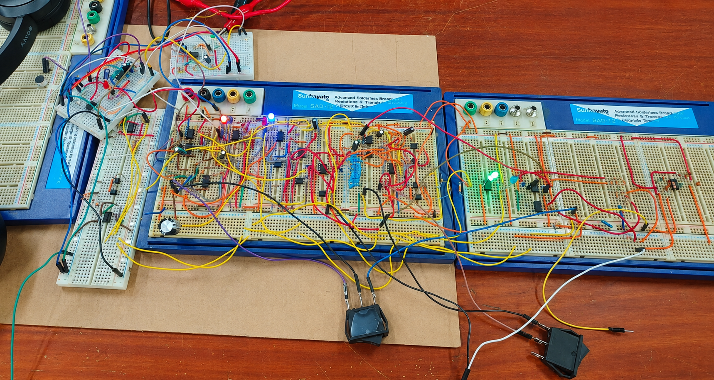
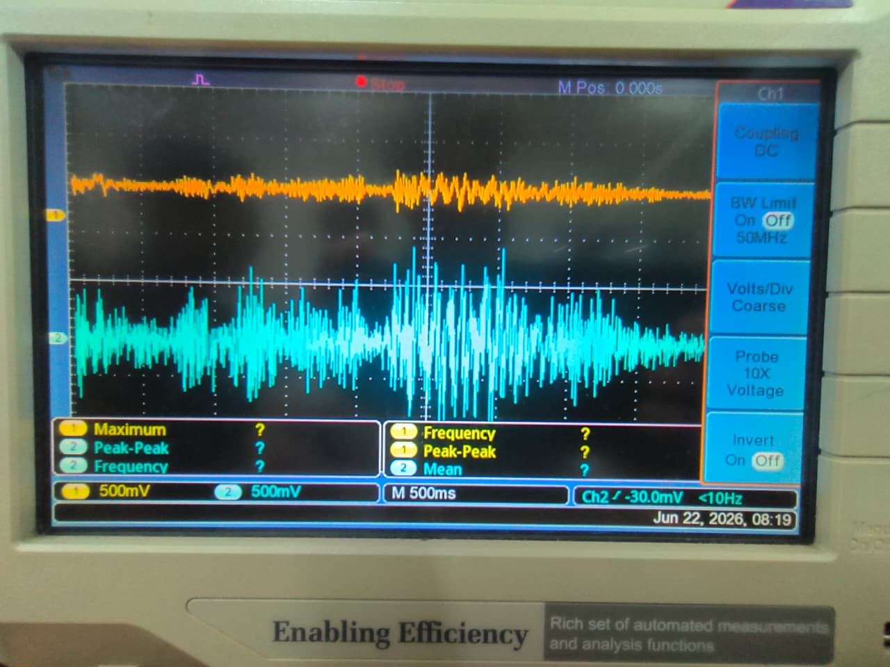

# 🎙️ Active Noise Canceling Pre-Amplifier

An analog electronic circuit designed to remove ambient background noise from live speech in public address systems, using a dual-microphone architecture, dynamic amplitude equalization, and active subtraction. 

 

## 📌 Overview

In public address systems, ambient background noise picked up by a speaker's microphone corrupts the intended audio, degrading intelligibility for the audience. This project proposes a fully analog, op-amp-based active noise cancellation circuit that uses two oppositely-oriented microphones — one capturing speech + noise, the other capturing noise alone — to actively subtract the ambient noise in real time, without relying on any digital signal processing.

## 🎯 Key Features

- 🎤 **Dual-Microphone Noise Sensing** — one mic captures speech + ambient noise, the other captures reference ambient noise only
- ⚖️ **Dynamic Multi-Layered Equalizer** — comparator-driven optocoupler network that normalizes amplitude mismatches between the two mic signals before subtraction
- ➖ **Precision Subtractor Circuit** — unity-gain op-amp difference amplifier removes common-mode ambient noise
- 🎚️ **Second-Order Sallen-Key Filtering** — cascaded low-pass and high-pass stages shape the output bandwidth to the speech range
- 🔌 **Fully Analog Signal Path** — no microcontroller or digital processing required
- 📈 **Simulated and Physically Validated** — verified in LTspice and on a breadboard prototype with oscilloscope measurements

## 🧩 Hardware Specifications

| Component | Description |
|---|---|
| Op-Amp | NE5532 — ultra-low-noise dual op-amp (8 nV/√Hz), high slew rate |
| Optocoupler | PC817 — isolated, voltage-controlled attenuator switching |
| Rectifier Diode | 1N5817 — Schottky diode, low forward voltage drop |
| Zener Diode | 3V — protects optocoupler LED from over-voltage |
| Resistor Network | 1.2 kΩ subtractor array, discrete attenuator ladder |
| Microphones | Dual electret condenser mics (primary + reference) |

## 🛠 System Architecture

The signal path integrates:

1. **Two microphones** capturing the corrupted speech signal and the ambient noise reference respectively
2. A **comparator-based error classifier** that measures the amplitude mismatch between the two noise signals
3. A **multi-layered equalizer** (comparators + PC817 optocouplers + attenuator/amplifier ladder) that dynamically corrects the amplitude mismatch
4. A **difference amplifier (subtractor)** that cancels the common-mode ambient noise
5. **Sallen-Key low-pass and high-pass filters** that bandlimit the cleaned output to the speech-relevant frequency range

All stages were first validated in LTspice simulation, then implemented and tested on a breadboard prototype.

## 📊 Results

- **Effective bandwidth:** ~110 Hz – 1 kHz, covering the primary speech intelligibility range (300 Hz–3000 Hz)
- **Measured SNR improvement:** ≈ 5.3 dB on the physical prototype (common-mode noise injection test)

## 🌍 Motivation and Relevance

- Addresses the common problem of ambient noise degrading speech clarity in public address setups (lectures, announcements, outdoor events)
- Fully analog approach avoids the cost, latency, and power draw of DSP-based solutions
- Designed and validated as a low-cost, hardware-only alternative to commercial ANC systems

## 👨‍🔬 Team Members

**Group 09 – EN2111, University of Moratuwa**

- H.W.D. Prabarshana (230495B) — Breadboard Implementation, Testing, Documentation
- H.D.J.D. Samaranayaka (230563H) — Simulation Design, Testing, Documentation
- W.M.H. Wanigasundara (230680M) — Breadboard Implementation, Testing, Documentation
- A.H.T.M. Weerakoon (230689A) — Simulation Design, Testing, Documentation

## 📚 References

- WHO Noise Guidelines Summary (Hearing Range Reference)
- Texas Instruments, *NE5532x, SA5532x Dual Low-Noise Operational Amplifiers* Datasheet
- Sharp Microelectronics, *PC817X Series High Density Photocoupler* Datasheet
- STMicroelectronics, *1N5711, 1N5712 Small Signal Schottky Diodes* Datasheet
- Vishay Semiconductors, *1N4728A to 1N4764A Zener Diodes* Datasheet
